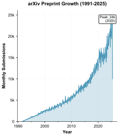

# Rxiv-Maker: An Automated Template Engine for Streamlined Scientific Publications
<!-- note that this title is not rendered in the PDF, instead the one in the YAML metadata is used -->

## Abstract
Scientific publishing increasingly relies on preprint servers for rapid dissemination, yet researchers often struggle with manuscript preparation and quality control. Here we present Rxiv-Maker, a GitHub-native framework that converts markdown content to publication-ready PDFs through automated LaTeX processing. The system addresses reproducibility challenges in computational biology and imaging research by treating manuscripts as executable outputs rather than static documents. Rxiv-Maker integrates version control workflows with automated build environments, enabling collaborative manuscript development whilst maintaining computational provenance. The framework supports programmatic figure generation, essential for microscopy and image analysis workflows where visualisations must reflect current data and processing algorithms. This manuscript, generated entirely using Rxiv-Maker, demonstrates the system's capacity to bridge accessible authoring with professional typesetting, offering researchers a transparent pathway from data to publication that aligns with open science principles.

## Main

<!-- Introduction -->

{#fig:diagram tex_position="t"} **The Rxiv-Maker Diagram.** The system integrates Markdown content, YAML metadata, Python scripts, and bibliography files through a processing engine. This engine leverages GitHub Actions, virtual environments, and LaTeX to produce a publication-ready scientific article, demonstrating a fully automated and reproducible pipeline.

Today's research environment demands rapid sharing of findings through preprint servers such as arXiv, bioRxiv, and medRxiv [@Berg2016; @Abdill2019_biorxiv_growth; @Fraser2021_preprint_growth]. This growth, exemplified in @sfig:arxiv-growth, accelerates discovery whilst transferring quality control responsibilities from publishers to authors [@Vale2019_preprints;@Tennant2016_academic_publishing]. Traditional manuscript workflows rely on proprietary formats that resist integration with version control systems, creating barriers for collaborative research [@Lariviere2014; @da_Silva_2022_challenges]. In computational biology and imaging research, where data processing pipelines continuously evolve, maintaining synchronisation between analysis code and manuscript content becomes particularly challenging. Rxiv-Maker addresses these issues by providing a developer-centric framework that prioritises computational reproducibility over feature breadth. Rather than attempting universal format support, the system excels at producing publication-quality PDFs through automated LaTeX processing. This focus enables deep integration with Git workflows and continuous integration practices that have become standard in computational research. The framework embeds reproducibility safeguards typically handled by journal production teams, ensuring manuscripts remain buildable across different systems and time periods. Through GitHub Actions and controlled dependency management, Rxiv-Maker transforms manuscript preparation into a transparent, auditable process that aligns with modern research practices.

{#fig:workflow width="\textwidth" tex_position="t"} **Rxiv-Maker Workflow: User Input vs. Automated Processing.** The framework clearly separates user responsibilities (content creation and configuration) from automated processes (parsing, conversion, compilation, and output generation). Users only need to write content and set preferences. At the same time, the system handles all technical aspects of manuscript preparation automatically, ensuring a streamlined workflow from markdown input to publication-ready PDF output.

Rxiv-Maker prioritises reproducibility throughout the publication process [@Donoho2010;@Sandve2013_reproducible_research;@Wilson2014_software_carpentry]. Alongside allowing externally generated figures, the framework enables programmatic generation of figures and tables, following computational research best practices [@Scherer2020_reproducibility]. Instead of using static image files, which disconnect data from visualisation, the system utilises scripting languages like Python, combined with visualisation libraries such as Matplotlib [@Hunter2007_matplotlib] and Seaborn [@Waskom2021_seaborn]. Figures are generated directly from source data and analysis scripts during compilation, establishing a link between raw data and the final figure. When data is updated or analysis is refined, affected figures are automatically regenerated, ensuring consistency and preventing outdated visuals. The system also integrates Mermaid.js [@Mermaid2023_documentation] for generating diagrams and flowcharts from text-based syntax, which helps illustrate experimental workflows, conceptual models, and algorithms. The complete range of supported figure generation methods is detailed in @stable:figure-formats. This approach treats the manuscript as an executable output of the research process rather than a static document. Built upon the established HenriquesLab bioRxiv template [@HenriquesLab2015_template], Rxiv-Maker extends capabilities through automated processing pipelines and flexible deployment strategies. The architecture, detailed in @fig:diagram and comprehensively illustrated in @fig:workflow, provides robust build automation through GitHub Actions and virtual environments. The technical details of the figure generation system are described in @snote:figure-generation.

To understand Rxiv-Maker's unique features, it's essential to place it within the wider ecosystem of scientific authoring tools, which encompasses various paradigms and approaches to document creation. All-in-one publishing systems, like Quarto, are designed for maximum versatility, integrating features for multi-language and multi-format output from a single source. Real-time collaborative editors, such as Overleaf, democratise LaTeX authoring through web-based interfaces with low technical barriers. Computational narrative frameworks like MyST and Jupyter Book treat documents as executable entities, prioritising web-first, interactive outputs. Modern typesetting engines, such as Typst, represent a fundamental rethinking of the typesetting process, offering cleaner syntax and faster compilation. Rxiv-Maker occupies a specific niche within this ecosystem: developer-centric automation optimised for reproducible PDF preprint generation, with workflow reproducibility as its core strength. A detailed comparison of these approaches is provided in @stable:tool-comparison.

<!-- Results -->

Using the Rxiv-Maker framework results in a highly efficient and robust workflow for producing professional-quality scientific papers. The system's primary output is a fully typeset PDF document, as seen in the article you're currently reading, which was generated entirely using this process. The markdown source files are automatically converted into a structured LaTeX document, then compiled to produce a PDF with a clean, academic layout, proper pagination, and high-resolution figures. Bibliographic management is handled seamlessly through integration with a standard BibTeX file. The system automatically processes this file to generate correctly formatted in-text citations and a comprehensive bibliography section according to a specified citation style. This automation eliminates the tedious and error-prone task of manually formatting references.

The system's deployment strategy addresses a fundamental challenge in computational reproducibility: ensuring that research outputs can be reconstructed across different environments and time periods. Cloud-based GitHub Actions workflows provide standardised, auditable compilation processes that eliminate environment-dependent variability. Every tagged commit pushed to the repository triggers an automated workflow that provisions a fresh, controlled environment with specific versions of LaTeX, Python, and system dependencies. Alternatively, users can also manually trigger the automated workflow at any point. This approach eliminates the variability introduced by different local installations and provides a permanent, citable record of the exact computational environment used for each manuscript version. The resulting PDF artifacts are automatically archived and made available for download, creating an unbroken chain of computational provenance from source files to final output. For users requiring immediate feedback, the system also supports deployment in Google Colab notebooks, providing an interactive environment that maintains the same reproducibility guarantees while offering real-time compilation capabilities. A comprehensive comparison of available deployment strategies is provided in @stable:deployment-options.

The integration of programmatic figure generation was also validated, supporting interactive computational environments, such as Jupyter notebooks [@Jupyter2016_notebook]. Python scripts placed within the designated directory were automatically executed during compilation. These scripts loaded data, performed analyses, and generated visualisations, which were then saved as image files and seamlessly included in the final PDF. Similarly, Mermaid.js diagrams embedded within the markdown source were correctly rendered into SVG images and incorporated into the document. This programmatic integration demonstrates a closed loop of reproducibility, where the final manuscript serves as a verifiable and self-contained record of the research findings and their presentation.

<!-- Discussion and conclusions section -->

By integrating plain-text authoring with automated build environments, Rxiv-Maker provides a robust solution to consistency and reproducibility challenges in manuscript preparation. The framework's focused approach—optimising for a single, critical task rather than attempting broad functionality—enables deeper integration with version control systems and automation practices that are essential for modern research workflows. This specialisation allows the system to excel at what matters most for scientific preprints: reliability, reproducibility, and seamless integration with collaborative research practices. The approach embraces literate programming principles [@Knuth1984_literate_programming], creating documents that seamlessly blend narrative text with executable code. Rather than forcing researchers to become amateur typesetters, the system handles typesetting complexity while preserving the transparent, version-controlled workflow that modern research demands. The integration with Git provides transparent attribution, conflict-free merging of contributions, and a complete, auditable history of manuscript development [@Ram2013_git_science;@Perez-Riverol2016_github_bioinformatics].

The rise of preprints has fundamentally shifted quality control, typesetting, and reproducibility responsibilities from journal production staff to authors. Rxiv-Maker responds to this cultural shift by providing automated guardrails that researchers need to produce publication-quality work from initial public dissemination of their findings. By focusing on automated figure generation and standardised build processes, the framework enables creation of publications that are not just research reports, but computationally reproducible artefacts. This directly addresses reproducibility challenges by embedding best practices into the authoring workflow itself [@Donoho2010]. The framework's GitHub-native design leverages the infrastructure that has become the de facto standard for collaborative software development and is increasingly adopted for scientific projects, positioning researchers to benefit from the maturity and reliability of modern development practices.

The deliberate focus on PDF output via LaTeX represents a conscious design choice that optimises the preprint workflow. While this specialisation means the system does not currently support HTML or other web-native formats, this focused approach enables deeper optimisation for the specific requirements of scientific preprint preparation. Future development could extend format support through integration with universal document converters, such as Pandoc [@MacFarlane2022]. However, this would require careful consideration of how to maintain the current level of typographic control and reproducibility guarantees. The learning curve associated with Git and Markdown workflows reflects the investment required to leverage modern version control practices, which yield significant dividends in terms of reproducibility and collaboration capabilities. Concerns about reporting quality in preprints [@Kirkham2018_reporting] suggest opportunities for integrating automated quality checks and validation workflows. Future development will focus on deeper integration with data analysis environments, such as Jupyter notebooks, and the exploration of automated tools for assessing style, grammar, and scientific rigor, further enhancing the system's role as a comprehensive manuscript preparation platform.

The system also supports a range of advanced features that are essential for modern scientific publishing. The project structure is deliberately organised to separate content, configuration, and computational elements, reflecting best practices in software engineering and ensuring clarity and maintainability. All manuscript content, metadata, and bibliographic references are version-controlled, providing a transparent and auditable record of every change. This approach guarantees that every aspect of the publication process can be reproduced and verified, a principle that is fundamental to scientific integrity.

The markdown-to-LaTeX conversion pipeline is designed to handle complex academic syntax, including figures, tables, citations, and mathematical expressions, while preserving the semantic meaning and typographical quality of the final output. The system employs a multi-pass approach that protects literal content, such as code blocks and mathematical notation, during transformation. This ensures that even the most intricate scientific expressions are rendered accurately, and that the manuscript remains accessible to both technical and non-technical contributors. Special attention is given to the handling of subscript and superscript notation, which is essential for chemical formulas and scientific nomenclature. The framework supports both markdown-style and LaTeX-style syntax, allowing authors to write expressions such as $\text{H}_2\text{O}$, $\text{CO}_2$, $\text{Ca}^{2+}$, $\text{SO}_4^{2-}$, and $E=mc^2$ with ease, as well as temperature notation like 25°C, while also accommodating more complex mathematical constructs.

The system's mathematical typesetting capabilities extend to numbered equations, which are essential for scientific manuscripts. For instance, the fundamental equation relating mass and energy can be expressed as:

$$E = mc^2$${#eq:einstein}

The framework also supports more complex mathematical formulations, such as the standard deviation calculation commonly used in data analysis:

$$\sigma = \sqrt{\frac{1}{N-1} \sum_{i=1}^{N} (x_i - \bar{x})^2}$${#eq:std_dev}

Additionally, the system handles chemical equilibrium expressions, which are crucial in biochemical and chemical research:

$$K_{eq} = \frac{[\text{Products}]}{[\text{Reactants}]} = \frac{[\text{Ca}^{2+}][\text{SO}_4^{2-}]}{[\text{CaSO}_4]}$${#eq:equilibrium}

These numbered equations (@eq:einstein, @eq:std_dev, and @eq:equilibrium) demonstrate the framework's capability to handle diverse mathematical notation while maintaining proper cross-referencing throughout the manuscript. This functionality ensures that complex scientific concepts can be presented with the precision and clarity required for academic publication.

The Rxiv-Maker framework is optimised for reproducible PDF preprint generation, occupying a unique position within the broader ecosystem of scientific authoring tools. While platforms such as Overleaf and Quarto offer extensive multi-format publishing capabilities and collaborative editing, Rxiv-Maker distinguishes itself by providing a focused, developer-centric workflow that integrates seamlessly with version control and automated build environments. This specialisation enables deeper optimisation for the requirements of scientific preprint preparation, ensuring that manuscripts are not only professionally typeset but also computationally reproducible. The system's integration with GitHub Actions and support for both public and private repository workflows ensures that sensitive research content remains protected, while still benefiting from the full automation and reproducibility guarantees of the framework.

The deliberate focus on PDF output via LaTeX is a conscious design choice, allowing for precise typographic control and consistent formatting across different environments. While the system does not currently support HTML or other web-native formats, this specialisation enables the framework to excel at its primary task. Future development may explore integration with universal document converters such as Pandoc, but any extension of format support will be carefully considered to maintain the current level of reproducibility and typographic quality.

The framework's educational value extends beyond manuscript preparation, providing researchers with practical experience in version control, automated workflows, and computational reproducibility. By adopting Rxiv-Maker, researchers gain transferable skills that are increasingly essential in modern scientific practice, including proficiency with Git, Markdown, and continuous integration systems. The system is designed to be accessible to researchers without extensive technical backgrounds, with comprehensive documentation and intuitive workflows that lower the barrier to entry. Privacy and data protection are addressed through robust security measures, including support for private repositories and secure build environments, ensuring that confidential research content is safeguarded throughout the publication process.

The technical architecture of Rxiv-Maker also addresses the computational constraints inherent to cloud-based build systems, such as those imposed by GitHub Actions. Intelligent caching mechanisms and selective regeneration of content ensure efficient use of resources, enabling the system to handle substantial manuscripts with complex figures and extensive bibliographies. The framework supports the inclusion of high-resolution graphics and advanced figure layouts, including full-page figures and multi-panel presentations, while maintaining optimal document organisation and cross-referencing functionality.

By integrating these features into a cohesive and accessible workflow, Rxiv-Maker advances the principles of open science and reproducibility, empowering researchers to produce high-quality, transparent, and verifiable scientific publications. This approach reflects a commitment to democratising access to advanced publishing tools and fostering collaboration across the scientific community.

## Methods

The following section provides a detailed technical description of the Rxiv-Maker framework, serving both as the methods for this paper and as a practical demonstration of the system's capacity to generate complex, structured documentation from source code and plain text. A comprehensive overview of the system architecture is provided in @sfig:architecture.

### Processing Pipeline
The Rxiv-Maker framework employs a multi-stage pipeline, orchestrated by a central `Makefile`, to convert manuscript source files into a compiled PDF. The workflow ensures a reproducible build process through several stages: environment setup, conditional generation of programmatic content, markdown-to-LaTeX conversion, asset aggregation, and final typesetting using a robust `pdflatex` sequence to resolve all cross-references and citations. For users without a local LaTeX setup, the framework provides identical build capabilities in the cloud via GitHub Actions.

### Markdown-to-LaTeX Conversion
Manuscript conversion is handled by a custom Python engine that processes an "extended academic Markdown" syntax. This multi-pass process first protects code blocks, then converts specialised elements, such as citations (`@smith2023`), figures, tables, and supplementary notes, before applying standard Markdown formatting. This ensures complex academic syntax is handled correctly. A comprehensive overview of the supported markdown syntax is provided in @stable:markdown-syntax. The system supports simple subscript and superscript notation using markdown-style syntax: $\text{H}_2\text{O}$ for water, $\text{CO}_2$ for carbon dioxide, and mathematical expressions like Einstein's mass-energy equivalence (@eq:einstein). For more complex chemical notation, the framework seamlessly handles formulas such as $\text{Ca}^{2+}$ and $\text{SO}_4^{2-}$ (as demonstrated in @eq:equilibrium), as well as temperature notation like 25°C. Statistical calculations, including standard deviation (@eq:std_dev), are properly rendered with full mathematical typesetting capabilities. The framework also supports complex mathematical expressions for computational workflows:

$$\frac{\partial}{\partial t} \mathbf{u} + (\mathbf{u} \cdot \nabla) \mathbf{u} = -\frac{1}{\rho} \nabla p + \nu \nabla^2 \mathbf{u}$${#eq:navier_stokes}

This approach provides an accessible alternative to mathematical notation for common chemical formulas and scientific expressions commonly found in research manuscripts, while ensuring that complex equations like the Navier-Stokes equation (@eq:navier_stokes) are rendered with professional quality. The comprehensive mathematical formula support is detailed in @snote:mathematical-formulas. 

### Programmatic Content and Environments
A core feature is programmatic content generation, treating figures and diagrams as reproducible outputs. The build pipeline automatically executes scripts (e.g., Python, Mermaid) and uses caching to avoid redundant work. This ensures a verifiable link between data, code, and visualisations (@snote:figure-generation). To ensure reproducibility, Rxiv-Maker uses a multi-layered environment management strategy. Dependencies are pinned, and isolated local virtual environments are supported. For maximum consistency, GitHub Actions provides controlled, cloud-based build environments, guaranteeing reproducibility across systems and time.

### Quality Assurance
The framework's reliability is ensured by a multi-level validation protocol. Unit tests validate individual components, integration tests verify the end-to-end pipeline, and platform tests validate behavior in deployment environments, such as GitHub Actions. Additionally, a pre-commit pipeline enforces code formatting, linting, and type checking, ensuring high code quality.

## Data availability
arXiv monthly submission data used in this article is available at [https://arxiv.org/stats/monthly_submissions](https://arxiv.org/stats/monthly_submissions). The source code and data for the figures in this article are available at [https://github.com/henriques/rxiv-maker](https://github.com/henriques/rxiv-maker).

## Code availability
The Rxiv-Maker computational framework is available at [https://github.com/henriques/rxiv-maker](https://github.com/henriques/rxiv-maker). All source code is under an MIT License.

## Author contributions
Both Bruno M. Saraiva, Guillaume Jacquemet, and Ricardo Henriques conceived the project and designed the framework. All authors contributed to writing and reviewing the manuscript.

## Acknowledgements
B.S. and R.H. acknowledge support from the European Research Council (ERC) under the European Union’s Horizon 2020 research and innovation programme (grant agreement No. 101001332) (to R.H.) and funding from the European Union through the Horizon Europe program (AI4LIFE project with grant agreement 101057970-AI4LIFE and RT-SuperES project with grant agreement 101099654-RTSuperES to R.H.). Funded by the European Union. However, the views and opinions expressed are those of the authors only and do not necessarily reflect those of the European Union. Neither the European Union nor the granting authority can be held responsible for them. This work was also supported by a European Molecular Biology Organization (EMBO) installation grant (EMBO-2020-IG-4734 to R.H.), a Chan Zuckerberg Initiative Visual Proteomics Grant (vpi-0000000044 with https://doi.org/10.37921/743590vtudfp to R.H.), and a Chan Zuckerberg Initiative Essential Open Source Software for Science (EOSS6-0000000260). This study was supported by the Academy of Finland (no. 338537 to G.J.), the Sigrid Juselius Foundation (to G.J.), the Cancer Society of Finland (Syöpäjärjestöt, to G.J.), and the Solutions for Health strategic funding to Åbo Akademi University (to G.J.). This research was supported by the InFLAMES Flagship Program of the Academy of Finland (decision no. 337531).
