# Supplementary Information

**RXiv-Forge: An Automated Template Engine for Streamlined Scientific Publications**

This supplementary information provides additional technical details, implementation examples, and extended documentation for the RXiv-Forge framework. The content is organised into supplementary figures that illustrate system architecture and functionality, followed by supplementary notes that detail technical implementation aspects and provide practical examples of the auto-translation system.

## Supplementary Figures


{#sfig:workflow} **RXiv-Forge Workflow Details.** This figure provides a comprehensive overview of the RXiv-Forge system architecture, showing how the simplified file naming convention (00_CONFIG.yml, 01_MAIN.md, 02_SUPPLEMENTARY_INFO.md, 03_REFERENCES.bib) integrates with the processing engine to generate publication-ready documents. The system demonstrates the complete automation pipeline from markdown input to PDF output.

## Supplementary Tables

### RXiv-Forge Markdown Syntax Overview

| **Markdown Element** | **LaTeX Equivalent** | **Description** |
|------------------|------------------|-------------|
| `**bold text**` | `\textbf{bold text}` | Bold formatting for emphasis |
| `*italic text*` | `\textit{italic text}` | Italic formatting for emphasis |
| `# Header 1` | `\section{Header 1}` | Top-level section heading |
| `## Header 2` | `\subsection{Header 2}` | Second-level section heading |
| `### Header 3` | `\subsubsection{Header 3}` | Third-level section heading |
| `@citation` | `\cite{citation}` | Single citation reference |
| `[@cite1;@cite2]` | `\cite{cite1,cite2}` | Multiple citation references |
| `@fig:label` | `\ref{fig:label}` | Figure cross-reference |
| Image with attributes | `\begin{figure}...\end{figure}` | Figure with attributes (old format) |
| Image with caption | `\begin{figure}...\end{figure}` | Figure with separate caption (new format) |
| `- list item` | `\begin{itemize}\item...\end{itemize}` | Unordered list |
| `1. list item` | `\begin{enumerate}\item...\end{enumerate}` | Ordered list |
| `[link text](url)` | `\href{url}{link text}` | Hyperlink with custom text |
| `https://example.com` | `\url{https://example.com}` | Bare URL |
| `<!-- comment -->` | `% comment` | Comments (converted to LaTeX style) |
| Markdown table | `\begin{table}...\end{table}` | Table with automatic formatting |

{#stable:markdown-syntax rotate=90} **RXiv-Forge Markdown Syntax Overview.** Comprehensive overview of RXiv-Forge's markdown to LaTeX conversion capabilities, demonstrating the automated translation system that enables researchers to write in familiar markdown syntax while producing professional LaTeX output. 

## Supplementary Notes

### File Structure and Organisation

<!--TODO: write this section -->
Blablabla

### Figures and tables

<!--TODO: write this section -->
Blablabla

### Comparison with similar systems

<!--TODO: this section should compare RXiv-Forge with other systems like Overleaf, Quarto, etc. It should very positively highlight the positive aspects of alternative strategies. Explain that compared to the other approeaches, RXiv-Forge aims for simplicity at the cost of generalization, it aims to do only one this and that one thing very well - the production of high-quality scientific preprints for arXiv, bioRxiv, medRxiv and similar venues... -->


### Supplementary Note 2: Auto-Translation System Examples

The RXiv-Forge auto-translation system processes structured input files to generate professional LaTeX output. The following examples demonstrate the system's capabilities across different file types.

#### YAML Configuration Example (00_CONFIG.yml)

```yaml
title: "RXiv-Forge: An Automated Template Engine for Streamlined Scientific Publications"
short_title: "RXiv-Forge"
authors:
  - name: "Bruno M. Saraiva"
    affiliation: [1, 2]
    email: "bruno.saraiva@example.com"
    orcid: "0000-0000-0000-0000"
  - name: "Guillaume Jaquemet"
    affiliation: [3]
    email: "guillaume.jaquemet@example.com"
    orcid: "0000-0000-0000-0000"
  - name: "Ricardo Henriques"
    affiliation: [1, 2]
    email: "ricardo.henriques@example.com"
    orcid: "0000-0000-0000-0000"
    corresponding: true

affiliations:
  1: "Instituto Gulbenkian de Ciência, Oeiras, Portugal"
  2: "University College London, London, United Kingdom"
  3: "Åbo Akademi University, Turku, Finland"

abstract: "Modern scientific publishing requires..."
keywords: ["scientific publishing", "reproducibility", "automation"]
```

#### Markdown Content Structure (01_MAIN.md)

```markdown
## Abstract
Modern scientific publishing has shifted towards rapid dissemination...

## Main
Scientific publishing has undergone profound transformation...

{#fig:1}

Statistical analysis demonstrates significant improvements [@reference2023].

## Methods
The RXiv-Forge framework orchestrates computational tools...
```

#### BibTeX Reference Format (03_REFERENCES.bib)

```bibtex
@article{Tennant2016_academic_publishing,
  title={The academic, economic and societal impacts of Open Access},
  author={Tennant, Jonathan P and Waldner, Fran{\c{c}}ois and Jacques, Damien C},
  journal={PLoS Biology},
  volume={14},
  number={7},
  pages={e1002510},
  year={2016},
  publisher={Public Library of Science}
}

@article{Fraser2021_preprint_growth,
  title={The relationship between bioRxiv preprints and citations},
  author={Fraser, Nicholas and Momeni, Fakhri and Mayr, Philipp and Peters, Isabella},
  journal={Quantitative Science Studies},
  volume={2},
  number={2},
  pages={618--638},
  year={2021}
}
```

### Supplementary Note 3: Technical Implementation Pipeline

The system processes these files through a sophisticated conversion pipeline:

1. **Configuration Parsing**: Extracts metadata from YAML configuration file, including author information, affiliations, and document settings
2. **Content Conversion**: Transforms markdown syntax into LaTeX formatting, preserving cross-references, citations, and figure placements
3. **Figure Generation**: Executes Python scripts and processes Mermaid diagrams automatically during compilation
4. **Document Assembly**: Combines all components into a cohesive LaTeX document using the template system
5. **Citation Processing**: Integrates BibTeX references with proper formatting and cross-referencing
6. **Output Compilation**: Produces publication-ready PDF with professional typesetting and formatting

This approach ensures reproducibility, version control compatibility, and automated processing whilst maintaining the flexibility needed for academic publishing. The system automatically handles complex LaTeX formatting requirements, enabling researchers to focus on content creation rather than technical implementation details.
