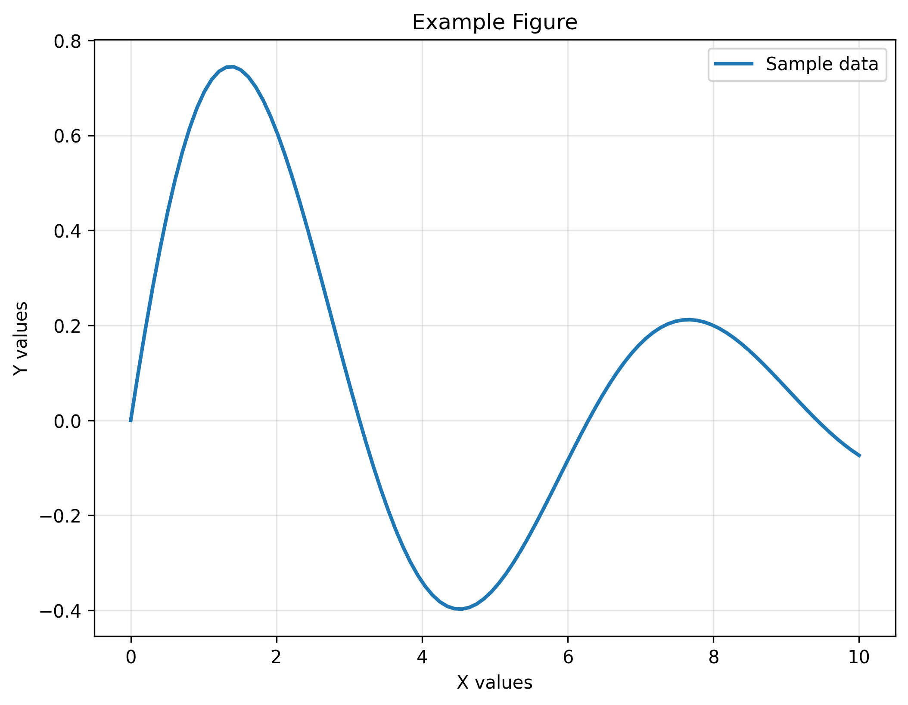

# Article Title Template
<!-- Note: This title is not rendered in the PDF; the title from 00_CONFIG.yml is used instead -->

## Abstract

Your abstract goes here. This should be a concise summary of your research. You can include citations like [@reference2024] and cross-references to figures like @fig:example.

## Introduction

Write your introduction here. Use **bold** and *italic* formatting as needed. Reference your figures using @fig:example and your tables as shown below.

You can include equations:
$$E = mc^2$${#eq:einstein}

And reference them using @eq:einstein.

## Methods

Describe your methodology here. Include code blocks when relevant:

```python
# Example code
import numpy as np
import matplotlib.pyplot as plt

# Your code here
data = np.random.randn(100)
plt.hist(data)
plt.savefig('histogram.png')
```

## Results

Present your results here. Include figures and tables:


{#fig:example} **Example Figure Caption.** Describe what your figure shows.

| Column 1 | Column 2 | Column 3 |
|----------|----------|----------|
| Data 1   | Data 2   | Data 3   |
| Data 4   | Data 5   | Data 6   |

{#tbl:example} **Example Table Caption.** Describe what your table contains.

## Discussion

Discuss your findings here. Reference supplementary information using @snote:example if needed.

## Conclusions

Summarize your main conclusions here.

## Data availability

Describe where your data is available.

## Code availability

Describe where your code is available.

## Author contributions

Describe author contributions here.

## Acknowledgements

Add your acknowledgements here.