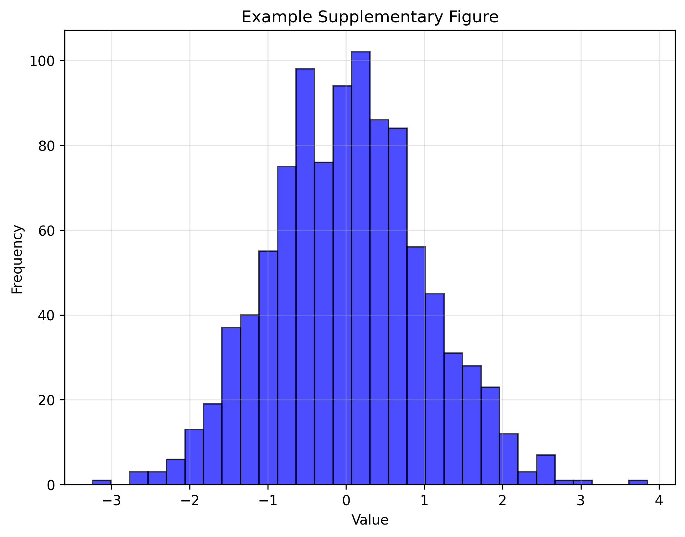

# Supplementary Information

## Supplementary Tables

| Parameter | Value | Description |
|-----------|-------|-------------|
| Sample size | 100 | Number of samples analyzed |
| Temperature | 25°C | Experimental temperature |
| Duration | 2 hours | Experimental duration |

{#stable:parameters} **Experimental Parameters.** Key parameters used in the study.

## Supplementary Notes

{#snote:example} **Example Supplementary Note.**

This is an example of a supplementary note that can be referenced from the main text using @snote:example. You can include detailed methodology, additional data analysis, or extended discussion here.

You can include mathematical expressions:
$$\int_{0}^{\infty} e^{-x^2} dx = \frac{\sqrt{\pi}}{2}$$

And code blocks:
```python
# Example supplementary code
import numpy as np
result = np.mean(data)
```

{#snote:methods} **Extended Methods.**

Provide detailed methodology that supplements the main text. Include step-by-step procedures, additional protocols, or technical specifications here.

## Supplementary Figures


{#sfig:example} **Example Supplementary Figure.** Caption describing the supplementary figure content.