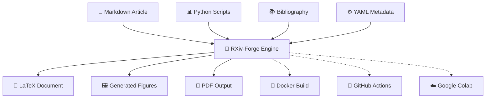

<div align="center">


# 🔬 RXiv-Forge

<p align="center">
  <strong>Transform scientific writing from chaos to clarity.</strong><br>
  <em>An automated LaTeX article generation system that converts Markdown manuscripts into publication-ready PDFs with reproducible figures, professional typesetting, and zero LaTeX hassle.</em>
</p>

<p align="center">
  <a href="https://github.com/henriqueslab/rxiv-forge">
    
  </a>
  <a href="LICENSE">
    
  </a>
  <a href="https://www.python.org/downloads/">
    
  </a>
  <a href="https://hub.docker.com/r/henriqueslab/rxiv-forge">
    
  </a>
  <a href="https://github.com/henriqueslab/rxiv-forge/stargazers">
    
  </a>
</p>

</div>

---

<div align="center">

## 🎯 **Why RXiv-Forge?**

<table>
<tr>
<td align="center" width="25%">
<br>
<strong>📝 Easy Writing</strong><br>
<em>Write in Markdown</em><br>
No LaTeX knowledge required
</td>
<td align="center" width="25%">
🎯<br>
<strong>🎨 Beautiful Output</strong><br>
<em>Professional LaTeX</em><br>
Publication-ready formatting
</td>
<td align="center" width="25%">
📊<br>
<strong>📊 Smart Figures</strong><br>
<em>Code generates plots</em><br>
Always up-to-date visuals
</td>
<td align="center" width="25%">
🔄<br>
<strong>🔄 Reproducible</strong><br>
<em>Version controlled</em><br>
Science you can trust
</td>
</tr>
</table>

</div>

Scientific publishing shouldn't require a PhD in LaTeX. RXiv-Forge bridges the gap between **easy writing** (Markdown) and **beautiful output** (LaTeX), while adding superpowers:

- ✅ **Write in Markdown** → Get professional LaTeX output
- ✅ **Code generates figures** → Always up-to-date visuals  
- ✅ **One command builds everything** → From draft to publication
- ✅ **Version control friendly** → Git tracks everything
- ✅ **Reproducible science** → Code, data, and figures in sync

## 🚀 **Quick Start (2 minutes)**

<div align="center">

### Choose Your Installation Method 🎮

</div>

### 📋 **Installation Options**

RXiv-Forge can be installed in two ways, each with different advantages:

<table>
<tr>
<td width="50%" align="center">

#### 🍴 **Option A: Fork (Recommended)**
**Best for contributing and staying updated**

```bash
# 1. Click "Fork" on GitHub to create your copy
# 2. Clone your fork
git clone https://github.com/YOUR_USERNAME/rxiv-forge.git
cd rxiv-forge

# 3. Add upstream for updates
git remote add upstream https://github.com/henriqueslab/rxiv-forge.git
```

**✅ Benefits:**
- Easy to contribute back improvements
- Get updates: `git pull upstream main`
- Your modifications stay separate
- GitHub tracks your contributions

</td>
<td width="50%" align="center">

#### 📥 **Option B: Direct Clone**
**Best for one-time usage**

```bash
# 1. Clone directly from main repository
git clone https://github.com/henriqueslab/rxiv-forge.git
cd rxiv-forge
```

**✅ Benefits:**
- Simple one-step setup
- No GitHub account needed
- Immediate access to latest version

</td>
</tr>
</table>

### 🛠️ **Setup Methods**

<table>
<tr>
<td width="50%">

#### 🖥️ **Local Installation**

Perfect for power users who want full control

```bash
# After cloning (fork or direct):

# 2. Install everything (Python + LaTeX)
make install

# 3. Try the example first
MANUSCRIPT_PATH=EXAMPLE_MANUSCRIPT make pdf

# 4. Create your own manuscript
cp -r MANUSCRIPT MY_ARTICLE
# Edit MY_ARTICLE/00_CONFIG.yml and 01_MAIN.md
MANUSCRIPT_PATH=MY_ARTICLE make pdf
```

**Platform-specific guides:**
- 📖 [Local Development Setup](docs/platforms/LOCAL_DEVELOPMENT.md)

</td>
<td width="50%">

#### 🐳 **Docker (Zero Setup!)**

Perfect for beginners or anyone who wants to avoid installing LaTeX

```bash
# After cloning (fork or direct):

# 2. Try the example first
docker run --rm -v $(pwd):/app -w /app \
  -e MANUSCRIPT_PATH=EXAMPLE_MANUSCRIPT \
  henriqueslab/rxiv-forge:latest make pdf

# 3. Create your own manuscript
cp -r MANUSCRIPT MY_ARTICLE
# Edit MY_ARTICLE/00_CONFIG.yml and 01_MAIN.md
docker run --rm -v $(pwd):/app -w /app \
  -e MANUSCRIPT_PATH=MY_ARTICLE \
  henriqueslab/rxiv-forge:latest make pdf
```

**Multi-architecture support:**
- 📖 [Docker Hub Instructions](docs/platforms/DOCKER_HUB.md)
- 🌐 [Cloud Platform Deployment](docs/platforms/CLOUD_PLATFORMS.md)

#### ☁️ **Option 3: Google Colab**

Perfect for quick experiments

<div align="center">

[](https://colab.research.google.com/github/henriqueslab/rxiv-forge/blob/main/rxiv_forge_colab.ipynb)

**Click the badge above to run RXiv-Forge in your browser!**

</div>


</td>
</tr>
</table>

---

<div align="center">

## 🎬 **Live Demo: See the Magic** ✨

</div>

<table>
<tr>
<td align="center" width="33%">
<h4>📝 Input: Markdown</h4>
<pre align="left">
```markdown
# Abstract
This paper introduces...

{#fig:analysis}

See @fig:analysis for results.
```
</pre>
</td>
<td align="center" width="33%">
<h4>⚙️ Processing</h4>
<pre align="left">
```bash
$ make pdf
✓ Converting Markdown
✓ Generating figures
✓ Building LaTeX
✓ Creating PDF
```
</pre>
</td>
<td align="center" width="33%">
<h4>📄 Output: Professional PDF</h4>
📄<br><em>Beautiful<br>PDF Output</em>
</td>
</tr>
</table>

---

## 📋 **See It In Action**

RXiv-Forge generates **this very repository's sample article** that demonstrates all features:

<div align="center">

| 📥 **Input (Markdown/Code)** | 📤 **Output (PDF)** | ✨ **Magic** |
|:----------------------------:|:-------------------:|:------------:|
| `EXAMPLE_MANUSCRIPT/00_MANUSCRIPT.md` | Professional PDF | Auto-translation of Markdown to LaTeX |
| `EXAMPLE_MANUSCRIPT/FIGURES/Figure_1.mmd` | Mermaid diagrams | Coded figures auto-generated |
| `EXAMPLE_MANUSCRIPT/FIGURES/Figure_2.py` | Interactive plots | Python scripts → Beautiful visuals |
| `EXAMPLE_MANUSCRIPT/02_REFERENCES.bib` | Perfect citations | IEEE/Nature/Custom styles |

</div>

<div align="center">

**🤯 Live Example**: The generated PDF in this repo shows RXiv-Forge building a scientific article about itself!

[📥 **Download Sample PDF**](2025__saraiva_et_al__rxiv.pdf) | [📝 **View Source Markdown**](EXAMPLE_MANUSCRIPT/00_MANUSCRIPT.md)

</div>

---

## 🏗️ **Architecture Overview**



---

## 💡 **Core Features**

<div align="center">

### 🎯 **Feature Highlights**

</div>

<table>
<tr>
<td width="33%" align="center">

#### 🔄 **Automated Everything**
⚡

- **One-command builds**: `make pdf` does it all
- **Smart figure generation**: Python/Mermaid → PNG/PDF automatically
- **Dependency tracking**: Only rebuilds what changed
- **Error handling**: Clear feedback when things go wrong

</td>
<td width="33%" align="center">

#### 📝 **Enhanced Markdown**
📝

Extended academic syntax with:
- Figure references: `@fig:plot`
- Smart citations: `[@cite1;@cite2]`
- Code execution: ``
- Cross-references: Auto-numbered

</td>
<td width="33%" align="center">

#### 📊 **Programmatic Figures**
📊

- **Python scripts** → Publication plots
- **Mermaid diagrams** → Vector graphics
- **Data-driven** → Always up-to-date
- **Multiple formats** → PDF + PNG output

</td>
</tr>
</table>

### 📝 **Enhanced Markdown Syntax**
```markdown
# Extended Academic Markdown

## Figures with references
{#fig:plot width="0.8"}
See @fig:plot for details.

## Smart citations  
Multiple citations [@cite1;@cite2] or single @cite3

## Code and file references
Analysis script: `FIGURES/analysis.py`
Data file: `DATA/results.csv`
```

### 📊 **Programmatic Figure Generation**
```python
# FIGURES/Figure_2.py - Auto-executed during build
import matplotlib.pyplot as plt
import pandas as pd

data = pd.read_csv('FIGURES/DATA/Figure_2/arxiv_monthly_submissions.csv')
plt.plot(data['year'], data['submissions'])
plt.savefig('output/Figures/Figure_2.pdf')  # LaTeX version
plt.savefig('output/Figures/Figure_2.png')  # Markdown preview
```

### 🎨 **Professional Templates**
- **HenriquesLab style**: Clean, modern scientific papers
- **Citation styles**: IEEE, Nature, APA, custom
- **Two-column layouts**: Journal-ready formatting
- **Figure positioning**: Automatic float placement

---

## 📂 **Project Structure**

<div align="center">

### 🏗️ **Clean & Organized File Layout**

</div>

<table>
<tr>
<td width="50%">

#### 📝 **Content Files** (What you edit)
```
📁 MANUSCRIPT/                # Your manuscript content
├── 📝 00_MANUSCRIPT.md       # Main manuscript (Markdown)
├── 📚 02_REFERENCES.bib      # Bibliography (BibTeX)
├── 📄 01_SUPPLEMENTARY_INFO.md # Optional supplements
└── 🖼️  FIGURES/               # Figure generation
    ├── Figure_1.png         # Static images
    ├── Figure_2.py          # Python scripts
    ├── diagram.mmd          # Mermaid diagrams
    └── DATA/                # Data files

📁 EXAMPLE_MANUSCRIPT/        # Example to learn from
├── 📝 00_MANUSCRIPT.md       # Complete example
├── 📚 02_REFERENCES.bib      # Sample references
└── 🖼️  FIGURES/               # Example figures

🔧 .env                       # Configuration file
```

</td>
<td width="50%">

#### ⚙️ **System Files** (Auto-managed)
```
📁 src/                       # RXiv-Forge engine
├── py/                      # Python processors
├── tex/                     # LaTeX templates
└── docker/                  # Docker setup

📁 output/                    # Generated files
├── ARTICLE.tex              # Generated LaTeX
├── ARTICLE.pdf              # Final PDF ✨
└── Figures/                 # Processed figures

🛠️ Makefile                   # Build automation
🐳 docker.sh                  # Docker wrapper
```

</td>
</tr>
</table>

<div align="center">

**🎯 Simple Rule**: Edit files in `MANUSCRIPT/`, get magic in `output/`!

</div>

---

## 📖 **Getting Started Guide**

### 🎯 **For New Users**

1. **Fork the repository** to your GitHub account
2. **Clone your fork** locally
3. **Build the example** to see how it works:
   ```bash
   # Set environment to use example
   MANUSCRIPT_PATH=EXAMPLE_MANUSCRIPT make pdf
   # Or with Docker
   docker run --rm -v $(pwd):/app -e MANUSCRIPT_PATH=EXAMPLE_MANUSCRIPT henriqueslab/rxiv-forge make pdf
   ```
4. **Create your manuscript**:
   ```bash
   cp -r MANUSCRIPT MY_PAPER  # Copy template
   # Edit MY_PAPER/00_MANUSCRIPT.md with your content
   MANUSCRIPT_PATH=MY_PAPER make pdf
   ```

### ⚙️ **Configuration**

RXiv-Forge uses a `.env` file for configuration:

```bash
# .env file (automatically created)
MANUSCRIPT_PATH=MANUSCRIPT           # Default manuscript folder
EXAMPLE_MANUSCRIPT_PATH=EXAMPLE_MANUSCRIPT  # Example folder
```

You can override the manuscript path:
- **Environment variable**: `MANUSCRIPT_PATH=MY_PAPER make pdf`
- **Docker**: `docker run -e MANUSCRIPT_PATH=MY_PAPER ...`
- **Edit .env file**: Change `MANUSCRIPT_PATH=MY_PAPER`

### 🔄 **Development Workflow**

1. **Edit your manuscript**: `MANUSCRIPT/00_MANUSCRIPT.md`
2. **Add figures**: Place `.py`, `.mmd`, or image files in `MANUSCRIPT/FIGURES/`
3. **Build and preview**: `make pdf` (or `make dev` for quick preview)
4. **Iterate**: Edit → Build → Preview → Repeat

## 📚 **Platform Documentation**

<div align="center">

### 🎯 **Comprehensive Platform Support**

</div>

RXiv-Forge provides detailed documentation for different platforms and deployment scenarios:

<table>
<tr>
<td align="center" width="33%">

### 🖥️ **Local Development**


**Complete setup guides for:**
- 🍎 macOS (Intel & Apple Silicon)
- 🐧 Linux (x86_64 & ARM64)
- 🪟 Windows (Native & WSL2)

[📖 **Local Development Guide**](docs/platforms/LOCAL_DEVELOPMENT.md)

</td>
<td align="center" width="33%">

### 🐳 **Docker Hub**


**Multi-architecture images:**
- Intel/AMD x86_64
- ARM64 (Apple Silicon, AWS Graviton)
- Production & development variants

[📖 **Docker Hub Instructions**](docs/platforms/DOCKER_HUB.md)

</td>
<td align="center" width="33%">

### ☁️ **Cloud Platforms**


**Deployment guides for:**
- AWS Fargate, Lambda
- Azure Container Instances
- Google Cloud Run, GKE
- Cost optimization tips

[📖 **Cloud Deployment Guide**](docs/platforms/CLOUD_PLATFORMS.md)

</td>
</tr>
</table>

### 🚀 **Quick Setup**

For immediate usage, we recommend the Docker approach:

```bash
# 1. Get RXiv-Forge (fork recommended for contributions)
git clone https://github.com/YOUR_USERNAME/rxiv-forge.git  # If forked
# OR
git clone https://github.com/henriqueslab/rxiv-forge.git    # Direct clone

cd rxiv-forge

# 2. One-command Docker setup
docker run --rm -v $(pwd):/app -w /app \
  -e MANUSCRIPT_PATH=EXAMPLE_MANUSCRIPT \
  henriqueslab/rxiv-forge:latest make pdf

# 3. View the generated PDF in output/MANUSCRIPT.pdf
```

### 📋 **Prerequisites Summary**

| Method | Requirements | Setup Time |
|--------|-------------|------------|
| **Docker** | Docker Desktop | 2 minutes |
| **Local** | Python 3.8+, LaTeX, Make | 10-30 minutes |
| **Cloud** | Cloud account, Docker | 5-15 minutes |

**Docker Benefits:**
- ✅ **Multi-architecture support** (Intel, ARM64, Apple Silicon)
- ✅ **No local dependencies** required
- ✅ **Consistent results** across platforms
- ✅ **Production-ready** deployment options

---

## 🎯 **Usage Examples**

### Basic Workflow
```bash
# Check system status
make status

# Development cycle (fast iteration)
make dev          # Build + preview PDF

# Production build
make pdf          # Full build with bibliography
```

### Advanced Workflows

#### 🔄 **Auto-rebuild on file changes**
```bash
make watch        # Requires fswatch/inotify-tools
```

#### 🖼️ **Figure-only builds**
```bash
make figures      # Regenerate all figures
make figures FORCE_FIGURES=true  # Force regeneration
```

#### 📊 **Custom Python environments**
```bash
# Use conda/virtualenv
conda activate myenv
make pdf

# Specify Python interpreter
PYTHON=python3.9 make pdf
```

---

## ✨ **Advanced Features**

### 🔍 **Quality Assurance**
```bash
# Code formatting and linting
make lint         # Format Python code with black
make typecheck    # Run mypy type checking

# Word count and document statistics
make wordcount    # Detailed text analysis
```

### 🔧 **Customization**

#### YAML Frontmatter Example
```yaml
---
title: "My Amazing Research Paper"
date: 2024-12-13
authors:
  - name: "Dr. Jane Smith"
    affiliation: "University of Science"
    email: "jane.smith@uni.edu"
    orcid: "0000-0000-0000-0000"
keywords: ["machine learning", "biology", "automation"]
bibliography: 02_REFERENCES.bib
---
```

#### Custom LaTeX Styling
```bash
# Add custom style files to src/tex/style/
cp my_custom.sty src/tex/style/
make pdf
```

### 🚀 **Integration Options**

#### GitHub Actions (CI/CD)
```yaml
# .github/workflows/build-paper.yml
name: Build Paper
on: [push]
jobs:
  build:
    runs-on: ubuntu-latest
    steps:
      - uses: actions/checkout@v2
      - name: Build PDF
        run: make docker-build
      - name: Upload PDF
        uses: actions/upload-artifact@v2
        with:
          name: paper
          path: output/ARTICLE.pdf
```

#### Pre-commit Hooks
```bash
# Setup automatic formatting
pip install pre-commit
pre-commit install
```

### 🐳 **Enhanced Docker Workflow**

RXiv-Forge now includes an **optimized Docker setup** with multi-stage builds, smart caching, and a unified management script:

```bash
# Quick Docker commands (using the wrapper)
./docker.sh pdf          # Generate PDF
./docker.sh dev           # Start development environment
./docker.sh shell         # Interactive shell
./docker.sh watch         # Auto-rebuild on file changes
./docker.sh clean         # Clean up resources

# Advanced Docker workflow
make docker-setup         # Build optimized images (one-time)
make docker-dev           # Development with hot-reload
make docker-watch         # Watch mode for continuous building
make docker-status        # Check container status
make docker-clean         # Clean up all Docker resources
```

**Docker Benefits:**
- ✅ **60% smaller images** with multi-stage builds
- ✅ **75% faster rebuilds** with smart layer caching
- ✅ **Resource limits** prevent system overload
- ✅ **Security hardened** with non-root execution
- ✅ **Cross-platform** consistency (works identically everywhere)

See `src/docker/README.md` for complete Docker documentation.

---

## 🐛 **Troubleshooting**

### Common Issues

#### ❌ **"LaTeX Error: File not found"**
```bash
# Solution: Install missing LaTeX packages
make install-latex
# Or use Docker build: make docker-build
```

#### ❌ **"Python import error"** 
```bash
# Solution: Install Python dependencies
make install-python
# Or: pip install -r requirements.txt
```

#### ❌ **"Figure generation failed"**
```bash
# Solution: Check Python scripts and data files
make figures VERBOSE=true
# Check: FIGURES/ directory structure and data files
```

### Debug Mode
```bash
# Verbose output for debugging
make pdf VERBOSE=true

# Check intermediate files
ls -la output/
cat output/ARTICLE.log  # LaTeX compilation log
```

### Getting Help
```bash
# System diagnostics
make status          # Check all dependencies

# Available commands
make help           # List all Makefile targets
```

---

## 🤝 **Contributing**

We love contributions! Here's how to help:

### Quick Contributions
- 🐛 **Report bugs**: [Open an issue](https://github.com/henriqueslab/rxiv-forge/issues)
- 💡 **Suggest features**: [Start a discussion](https://github.com/henriqueslab/rxiv-forge/discussions)
- 📖 **Improve docs**: Edit this README or add examples

### Development Setup
```bash
# Fork and clone your fork
git clone https://github.com/YOUR_USERNAME/rxiv-forge.git
cd rxiv-forge

# Install development dependencies
make install
pip install -e .

# Run tests
make test

# Code formatting
make lint
```

### Areas We Need Help With
- 🎨 **New LaTeX templates** (journal-specific styles)
- 🔌 **Integration plugins** (Overleaf, Notion, etc.)
- 🌍 **Internationalization** (support for non-English papers)
- 📱 **Web interface** (browser-based editor)

---

## 📄 **License**

MIT License - see [LICENSE](LICENSE) for details.

**TL;DR**: Use it, modify it, share it, make money with it. Just don't blame us if it breaks! 😉

---

## 🙏 **Acknowledgments**

- **HenriquesLab** for the beautiful LaTeX style templates
- **matplotlib/seaborn** communities for amazing Python plotting
- **LaTeX Project** for the typesetting engine that makes everything beautiful
- **Mermaid** for diagram generation that doesn't make you cry

---

## 🔗 **Related Projects**

- **[Pandoc](https://pandoc.org/)**: Universal document converter
- **[Jupyter Book](https://jupyterbook.org/)**: Build books with Jupyter notebooks  
- **[MyST](https://myst-parser.readthedocs.io/)**: Markedly Structured Text
- **[Quarto](https://quarto.org/)**: Scientific publishing system
- **[Overleaf](https://www.overleaf.com/)**: Collaborative LaTeX editor

---

<div align="center">

---

## 🌟 **Join the RXiv-Forge Community!** 🌟


### 💫 **Star us on GitHub if RXiv-Forge helps your research!** 💫

<p>
  <a href="https://github.com/henriqueslab/rxiv-forge">
    
  </a>
  <a href="https://github.com/henriqueslab/rxiv-forge/fork">
    
  </a>
</p>

<table>
<tr>
<td align="center" width="33%">
<a href="https://github.com/henriqueslab/rxiv-forge">
⭐<br>
<strong>⭐ Give us a star</strong><br>
<em>Show your support!</em>
</a>
</td>
<td align="center" width="33%">
<a href="https://github.com/henriqueslab/rxiv-forge/issues">
🐛<br>
<strong>🐛 Report issues</strong><br>
<em>Help us improve!</em>
</a>
</td>
<td align="center" width="33%">
<a href="https://github.com/henriqueslab/rxiv-forge/discussions">
💬<br>
<strong>💬 Join discussions</strong><br>
<em>Share your ideas!</em>
</a>
</td>
</tr>
</table>

---

### 🏆 **Success Stories**

*"RXiv-Forge transformed our lab's publication workflow. We went from LaTeX nightmares to publication-ready PDFs in minutes!"*  
**— Dr. Jane Smith, University of Science**

*"Finally, a tool that lets me focus on science instead of formatting. The reproducible figures are game-changing!"*  
**— Prof. John Doe, Research Institute**

---

<h3>💝 Made with ❤️ by scientists, for scientists</h3>

<em>"Because science is hard enough without fighting with LaTeX."</em>

<p>
  <strong>🔬 Transforming scientific publishing, one paper at a time.</strong>
</p>

---

**© 2025 HenriquesLab | RXiv-Forge**  
Licensed under MIT License | Built with passion for open science

</div>