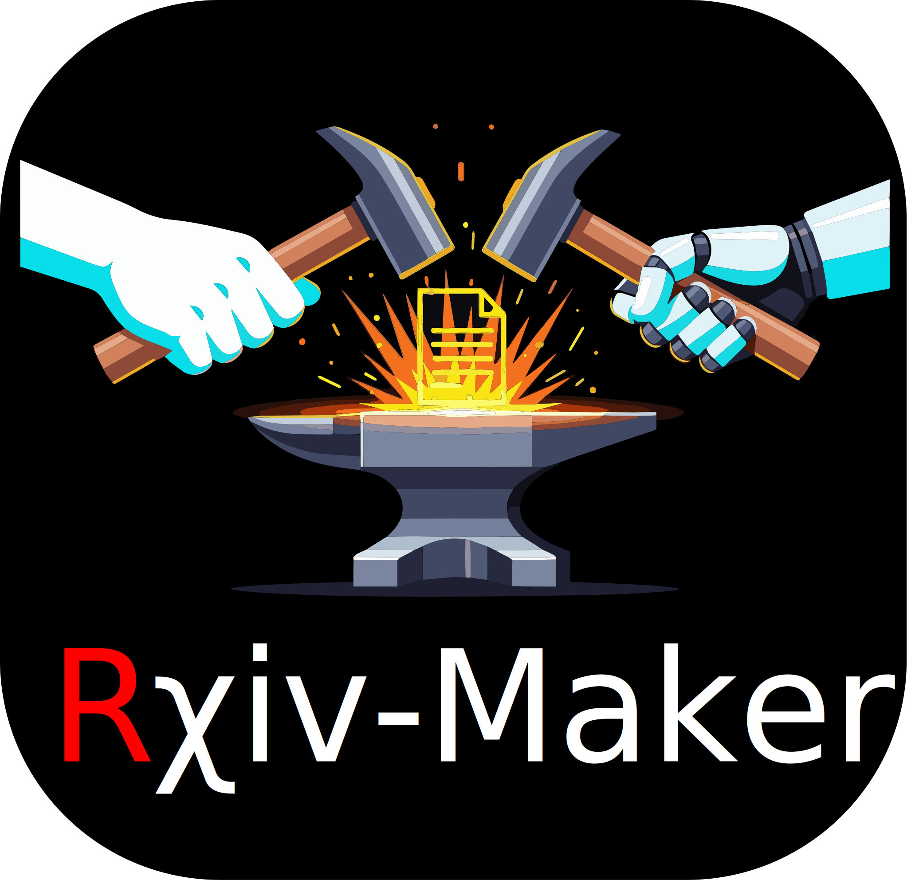

[](https://github.com/henriqueslab/rxiv-maker/blob/main/LICENSE)
[](https://github.com/henriqueslab/rxiv-maker/graphs/contributors)
[](https://github.com/henriqueslab/rxiv-maker/)
[](https://github.com/henriqueslab/rxiv-maker/)


# Rxiv-Maker



Rxiv-Maker is an automated LaTeX article generation system that transforms scientific writing from chaos to clarity. It converts Markdown manuscripts into publication-ready PDFs with reproducible figures, professional typesetting, and zero LaTeX hassle.

The platform bridges the gap between **easy writing** (Markdown) and **beautiful output** (LaTeX), featuring automated figure generation from Python scripts and Mermaid diagrams, seamless citation management, and integration with GitHub Actions for cloud-based PDF generation.

Rxiv-Maker enhances the capabilities of traditional scientific writing by ensuring version control compatibility, facilitating reproducible science workflows, and providing professional formatting that meets publication standards.

## Key Features

- **20+ Enhanced Markdown Features** including scientific cross-references, citations, subscript/superscript, and programmatic figure generation.
- **Automated Figure Generation** from Python scripts and Mermaid diagrams with smart caching and dependency management.
- **GitHub Actions Integration** for cloud-based PDF generation with manual triggers and automated releases.
- **Professional LaTeX Templates** supporting various citation styles and academic formatting conventions.
- **Version Control Friendly** with Git-based workflows and reproducible build processes.
- **Multi-Environment Support** including local development, Google Colab, and GitHub Actions automation.

<details>
<summary><strong>📋 Complete Markdown Feature List</strong></summary>

| **Markdown Element** | **LaTeX Equivalent** | **Description** |
|------------------|------------------|-------------|
| **Basic Text Formatting** | | |
| `**bold text**` | `\textbf{bold text}` | Bold formatting for emphasis |
| `*italic text*` | `\textit{italic text}` | Italic formatting for emphasis |
| `~subscript~` | `\textsubscript{subscript}` | Subscript formatting (H~2~O, CO~2~) |
| `^superscript^` | `\textsuperscript{superscript}` | Superscript formatting (E=mc^2^, x^n^) |
| **Document Structure** | | |
| `# Header 1` | `\section{Header 1}` | Top-level section heading |
| `## Header 2` | `\subsection{Header 2}` | Second-level section heading |
| `### Header 3` | `\subsubsection{Header 3}` | Third-level section heading |
| **Lists** | | |
| `- list item` | `\begin{itemize}\item...\end{itemize}` | Unordered list |
| `1. list item` | `\begin{enumerate}\item...\end{enumerate}` | Ordered list |
| **Links and URLs** | | |
| `[link text](url)` | `\href{url}{link text}` | Hyperlink with custom text |
| `https://example.com` | `\url{https://example.com}` | Bare URL |
| **Citations** | | |
| `@citation` | `\cite{citation}` | Single citation reference |
| `[@cite1;@cite2]` | `\cite{cite1,cite2}` | Multiple citation references |
| **Cross-References** | | |
| `@fig:label` | `\ref{fig:label}` | Figure cross-reference |
| `@sfig:label` | `\ref{sfig:label}` | Supplementary figure cross-reference |
| `@table:label` | `\ref{table:label}` | Table cross-reference |
| `@stable:label` | `\ref{stable:label}` | Supplementary table cross-reference |
| `@eq:label` | `\eqref{eq:label}` | Equation cross-reference |
| `@snote:label` | `\sidenote{label}` | Supplement note cross-reference |
| **Tables and Figures** | | |
| Markdown table | `\begin{table}...\end{table}` | Table with automatic formatting |
| Image with caption | `\begin{figure}...\end{figure}` | Figure with separate caption |
| **Document Control** | | |
| `<!-- comment -->` | `% comment` | Comments (converted to LaTeX style) |
| `<newpage>` | `\newpage` | Manual page break control |
| `<clearpage>` | `\clearpage` | Page break with float clearing |

</details>

## Key Benefits of Rxiv-Maker

- **Accessibility:** Write in familiar Markdown syntax without LaTeX expertise. Interactive workflows lower barriers for researchers.
- **Reproducibility:** Automated figure generation and version control ensure consistent results across builds.
- **Flexibility:** Generate PDFs locally, in the cloud, or via GitHub Actions. No vendor lock-in.
- **Professional Output:** LaTeX-quality formatting with automated bibliography and cross-reference management.
- **Collaboration:** Git-based workflows enable team editing with automated PDF generation for reviews.
- **Extensibility:** Modular architecture supports custom templates, styles, and figure generation scripts.

## What is Rxiv-Maker?

- A comprehensive manuscript generation system combining Markdown simplicity with LaTeX professionalism.
- Fully automated figure generation from Python scripts and Mermaid diagrams integrated into the document build process.
- GitHub Actions workflows provide cloud-based PDF generation with dependency caching and artifact management.
- Professional templates supporting academic publishing conventions, including author affiliations, ORCID integration, and citation styles.
- Version-controlled workflow enabling collaborative writing with automated quality checks and build validation.

## Quickstart

<details>
<summary><strong>🚀 Quick Start (2 minutes)</strong></summary>

### 🎯 **Which Option is Right for You?**

| User Type | Best Option | Requirements | Setup Time |
|-----------|-------------|--------------|------------|
| **📚 New to coding** | Google Colab | Google account | 2 minutes |
| **⚡ Want automation** | GitHub Actions | GitHub account | 5 minutes |
| **🔧 Full control** | Local Install | Python 3.9+, LaTeX, Make | 10-30 minutes |

### Google Colab (Easiest - No Installation Required)
**Perfect for beginners and quick experiments without any local setup.**

[](https://colab.research.google.com/github/henriqueslab/rxiv-maker/blob/main/rxiv_forge_colab.ipynb)

**✅ Perfect for:**
- First-time users wanting to try Rxiv-Maker
- Quick one-off document generation
- Users without technical setup experience
- Collaborative editing with shared notebooks

### GitHub Actions (Recommended for Regular Use)
**Automatic PDF generation on every commit - works with both public and private repos.**

1. **Fork** this repository to your GitHub account
2. **Go to Actions tab** → "Build and Release PDF"
3. **Click "Run workflow"** → Select manuscript path → "Run workflow"
4. **Download PDF** from completed workflow run

**✅ Perfect for:**
- Regular manuscript writing and revisions
- Team collaboration and version control
- Automatic backup and PDF generation
- Professional workflow without local setup

### Local Development (Full Control)
**First time? See [platform setup guide](docs/platforms/LOCAL_DEVELOPMENT.md) for Windows/macOS/Linux installation.**

```bash
# Clone the repository
git clone https://github.com/henriqueslab/rxiv-maker.git
cd rxiv-maker

# Set up environment
python -m venv .venv
source .venv/bin/activate  # On Windows: .venv\Scripts\activate
make setup

# Generate your first PDF
make pdf MANUSCRIPT_PATH=EXAMPLE_MANUSCRIPT
```

**✅ Perfect for:**
- Advanced users and developers
- Custom modifications and extensions
- Offline work environments
- Integration with local development tools

</details>

<details>
<summary><strong>📋 Installation Options</strong></summary>

### Option A: Fork (Recommended for Contributors)
```bash
# 1. Click "Fork" on GitHub
# 2. Clone your fork
git clone https://github.com/YOUR_USERNAME/rxiv-maker.git
cd rxiv-maker

# 3. Add upstream for updates
git remote add upstream https://github.com/henriqueslab/rxiv-maker.git
```

### Option B: Direct Clone
```bash
git clone https://github.com/henriqueslab/rxiv-maker.git
cd rxiv-maker
```

### Prerequisites
- **Local**: Python 3.9+, LaTeX, Make (10-30 minutes setup) - [Platform-specific instructions](docs/platforms/LOCAL_DEVELOPMENT.md)
- **GitHub Actions**: GitHub account (instant)
- **Colab**: Google account (instant)

</details>

<details>
<summary><strong>🖥️ Platform Setup</strong></summary>

### Local Development
```bash
# After cloning, install dependencies
make setup

# Test with example
make pdf MANUSCRIPT_PATH=EXAMPLE_MANUSCRIPT

# Create your manuscript
cp -r EXAMPLE_MANUSCRIPT MY_ARTICLE
# Edit MY_ARTICLE/00_CONFIG.yml and 01_MAIN.md
make pdf MANUSCRIPT_PATH=MY_ARTICLE
```

### Requirements
- **LaTeX**: Full installation required - [Windows/macOS/Linux guides](docs/platforms/LOCAL_DEVELOPMENT.md)
- **Python**: 3.9+ with virtual environment recommended
- **Make**: Build automation tool (included in platform guides)

</details>

## Core Workflow

1. **Write** your manuscript in Markdown (`01_MAIN.md`)
2. **Configure** metadata in YAML (`00_CONFIG.yml`)
3. **Create** figures with Python scripts or Mermaid diagrams
4. **Build** PDF locally (`make pdf`) or via GitHub Actions
5. **Collaborate** using Git workflows with automated PDF generation

## Documentation

### Essential Guides
- **[Google Colab Tutorial](docs/tutorials/google_colab.md)** – Browser-based PDF generation (no installation required)
- **[GitHub Actions Tutorial](docs/tutorials/github_actions.md)** – Automated PDF generation and team workflows
- **[GitHub Actions Guide](docs/github-actions-guide.md)** – Complete cloud PDF generation tutorial
- **[User Guide](docs/user_guide.md)** – Comprehensive usage instructions and troubleshooting
- **[Architecture Overview](docs/architecture.md)** – System design and technical details

### Platform-Specific Setup
- **[Windows/macOS/Linux Setup](docs/platforms/LOCAL_DEVELOPMENT.md)** – Complete installation guides for all platforms

### Reference Documentation
- **[API Reference](docs/api/README.md)** – Python API documentation

### Quick Reference
| Task | Command | Documentation |
|------|---------|---------------|
| Generate PDF | `make pdf` | [User Guide](docs/user_guide.md) |
| Cloud PDF Generation | Actions → "Run workflow" | [GitHub Actions Guide](docs/github-actions-guide.md) |
| Custom Manuscript | `make pdf MANUSCRIPT_PATH=MY_PAPER` | [User Guide](docs/user_guide.md) |
| Force Figure Regeneration | `make pdf FORCE_FIGURES=true` | [User Guide](docs/user_guide.md) |

## Project Structure

```
rxiv-maker/
├── MANUSCRIPT/              # Your manuscript files
│   ├── 00_CONFIG.yml       # Metadata and configuration
│   ├── 01_MAIN.md          # Main manuscript content
│   ├── 02_SUPPLEMENTARY_INFO.md  # Optional supplementary
│   ├── 03_REFERENCES.bib   # Bibliography
│   └── FIGURES/            # Figure generation scripts
├── output/                 # Generated PDFs and artifacts
├── src/                    # Rxiv-Maker source code
└── docs/                   # Documentation
```

<details>
<summary><strong>💡 Advanced Features</strong></summary>

### Multiple Manuscripts
```bash
# Work with different manuscript directories
make pdf MANUSCRIPT_PATH=PROJECT_A
make pdf MANUSCRIPT_PATH=PROJECT_B
```

### Custom Templates
```bash
# Add custom style files
cp my_style.sty src/tex/style/
# Reference in 00_CONFIG.yml
```

### Automated Workflows
- **GitHub Actions**: Cloud-based PDF generation with caching
- **Pre-commit Hooks**: Automated formatting and validation
- **Continuous Integration**: Automated testing and quality checks

</details>

<details>
<summary><strong>🔧 Troubleshooting</strong></summary>

### Common Issues
- **LaTeX not found**: Install LaTeX - [Windows/macOS/Linux setup](docs/platforms/LOCAL_DEVELOPMENT.md)
- **Python import errors**: Run `make setup` to install dependencies
- **Figure generation fails**: Check Python scripts and data files
- **GitHub Actions fails**: Review workflow logs and manuscript structure

### Debug Commands
```bash
# Verbose output
make pdf VERBOSE=true

# Check logs
cat output/MANUSCRIPT.log

# Test specific manuscript
make pdf MANUSCRIPT_PATH=EXAMPLE_MANUSCRIPT
```

### Getting Help
- [GitHub Issues](https://github.com/henriqueslab/rxiv-maker/issues)
- [Discussions](https://github.com/henriqueslab/rxiv-maker/discussions)
- [Documentation](docs/)

</details>

## Contributing

We welcome contributions! Check out our [contributing guidelines](CONTRIBUTING.md) and help improve Rxiv-Maker.

```bash
# Development setup
git clone https://github.com/henriqueslab/rxiv-maker.git
pip install -e ".[dev]"
pre-commit install
```

## Acknowledgments

We extend our gratitude to the scientific computing community, especially the matplotlib and seaborn communities for their plotting tools, the LaTeX Project for professional typesetting, and Mermaid for accessible diagram generation.

## License

MIT License - see [LICENSE](LICENSE) for details. Use it, modify it, share it freely.

---


**© 2025 Jacquemet and Henriques Labs | Rxiv-Maker**  
*"Because science is hard enough without fighting with LaTeX."*
