<div align="center">

<p align="center">
  <a href="https://github.com/henriqueslab/rxiv-maker/actions/workflows/build-pdf.yml">
    
  </a>
  <a href="LICENSE">
    
  </a>
  <a href="https://www.python.org/downloads/">
    
  </a>
  <a href="https://github.com/henriqueslab/rxiv-maker/stargazers">
    
  </a>
</p>


# 🔬 RXiv-Maker

<p align="center">
  <strong>Transform scientific writing from chaos to clarity.</strong><br>
  <em>An automated LaTeX article generation system that converts Markdown manuscripts into publication-ready PDFs with reproducible figures, professional typesetting, and zero LaTeX hassle.</em>
</p>


</div>

---

<div align="center">

## 🎯 **Why RXiv-Maker?**

<table>
<tr>
<td align="center" width="25%">
<br>
<strong>📝 Easy Writing</strong><br>
<em>Write in Markdown</em><br>
No LaTeX knowledge required
</td>
<td align="center" width="25%">
🎨<br>
<strong>🎨 Beautiful Output</strong><br>
<em>Professional LaTeX</em><br>
Publication-ready formatting
</td>
<td align="center" width="25%">
📊<br>
<strong>📊 Smart Figures</strong><br>
<em>Code generates plots</em><br>
Always up-to-date visuals
</td>
<td align="center" width="25%">
🔄<br>
<strong>🔄 Reproducible</strong><br>
<em>Version controlled</em><br>
Science you can trust
</td>
</tr>
</table>

</div>

Scientific publishing shouldn't require a PhD in LaTeX. RXiv-Maker bridges the gap between **easy writing** (Markdown) and **beautiful output** (LaTeX), while adding superpowers:

- ✅ **Write in Markdown** → Get professional LaTeX output
- ✅ **Code generates figures** → Always up-to-date visuals  
- ✅ **One command builds everything** → From draft to publication
- ✅ **GitHub Actions automation** → Auto-generates PDFs on every commit
- ✅ **Version control friendly** → Git tracks everything
- ✅ **Reproducible science** → Code, data, and figures in sync

## 🚀 **Quick Start (2 minutes)**

<div align="center">

### Choose Your Installation Method 🎮

</div>

### 📋 **Prerequisites**

| Method    | Requirements               | Setup Time    |
|-----------|----------------------------|---------------|
| **Local** | Python 3.9+, LaTeX, Make   | 10-30 minutes |
| **Colab** | Google account             | 2 minutes     |

<div align="center">
</div>

### 📋 **Installation Options**

RXiv-Maker can be installed in two ways, each with different advantages:

<table>
<tr>
<td width="50%" align="center">

#### 🍴 **Option A: Fork (Recommended)**
**Best for contributing and staying updated**

```bash
# 1. Click "Fork" on GitHub to create your copy
# 2. Clone your fork
git clone https://github.com/YOUR_USERNAME/rxiv-maker.git
cd rxiv-maker

# 3. Add upstream for updates
git remote add upstream https://github.com/henriqueslab/rxiv-maker.git
```

**✅ Benefits:**
- Easy to contribute back improvements
- Get updates: `git pull upstream main`
- Your modifications stay separate
- GitHub tracks your contributions

</td>
<td width="50%" align="center">

#### 📥 **Option B: Direct Clone**
**Best for one-time usage**

```bash
# 1. Clone directly from main repository
git clone https://github.com/henriqueslab/rxiv-maker.git
cd rxiv-maker
```

**✅ Benefits:**
- Simple one-step setup
- No GitHub account needed
- Immediate access to latest version

</td>
</tr>
</table>

### 🛠️ **Setup Method**

#### 🖥️ **Local Installation**

```bash
# After cloning (fork or direct):

# 1. Install LaTeX on your system (see platform-specific guides below)
# 2. Create and activate virtual environment
python -m venv .venv
source .venv/bin/activate  # On Windows: .venv\Scripts\activate

# 3. Install Python dependencies
make setup

# 4. Try the example first
MANUSCRIPT_PATH=EXAMPLE_MANUSCRIPT make pdf

# 5. Create your own manuscript
cp -r MANUSCRIPT MY_ARTICLE
# Edit MY_ARTICLE/00_CONFIG.yml and 01_MAIN.md
MANUSCRIPT_PATH=MY_ARTICLE make pdf
```

**Platform-specific LaTeX installation guides:**
- 📖 [Local Development Setup](docs/platforms/LOCAL_DEVELOPMENT.md)

#### ☁️ **Google Colab**

Perfect for quick experiments without local setup

<div align="center">

[](https://colab.research.google.com/github/henriqueslab/rxiv-maker/blob/main/rxiv_forge_colab.ipynb)

**Click the badge above to run RXiv-Maker in your browser!**

</div>

---

<div align="center">

## 🎬 **Live Demo: See the Magic** ✨

</div>

<table>
<tr>
<td align="center" width="33%">
<h4>📝 Input: Markdown</h4>
<pre align="left">
```markdown
# Abstract
This paper introduces...

{#fig:analysis}

See @fig:analysis for results.
```
</pre>
</td>
<td align="center" width="33%">
<h4>⚙️ Processing</h4>
<pre align="left">
```bash
$ make pdf
✓ Converting Markdown
✓ Generating figures
✓ Building LaTeX
✓ Creating PDF
```
</pre>
</td>
<td align="center" width="33%">
<h4>📄 Output: Professional PDF</h4>
📄<br><em>Beautiful<br>PDF Output</em>
</td>
</tr>
</table>

---

## 📋 **See It In Action**

RXiv-Maker generates **this very repository's sample article** that demonstrates all features:

<div align="center">

| 📥 **Input (Markdown/Code)** | 📤 **Output (PDF)** | ✨ **Magic** |
|:----------------------------:|:-------------------:|:------------:|
| `EXAMPLE_MANUSCRIPT/01_MAIN.md` | Professional PDF | Auto-translation of Markdown to LaTeX |
| `EXAMPLE_MANUSCRIPT/FIGURES/Figure_1.mmd` | Mermaid diagrams | Coded figures auto-generated |
| `EXAMPLE_MANUSCRIPT/FIGURES/Figure_2.py` | Interactive plots | Python scripts → Beautiful visuals |
| `EXAMPLE_MANUSCRIPT/02_REFERENCES.bib` | Perfect citations | IEEE/Nature/Custom styles |

</div>

<div align="center">

**🤯 Live Example**: The generated PDF in this repo shows RXiv-Maker building a scientific article about itself!

</div>

---

## 🏗️ **Architecture Overview**

```mermaid
graph TD
    A[📝 Markdown Article] --> E[🔄 RXiv-Maker Engine]
    B[📊 Python Scripts] --> E
    C[📚 Bibliography] --> E
    D[⚙️ YAML Metadata] --> E
    
    E --> F[📄 LaTeX Document]
    E --> G[🖼️ Generated Figures]
    E --> H[📖 PDF Output]
    

    E -.-> J[🤖 GitHub Actions]
    E -.-> K[☁️ Google Colab]
```



---

## 💡 **Core Features**

<div align="center">

### 🎯 **Feature Highlights**

</div>

<table>
<tr>
<td width="33%" align="center">

#### 🔄 **Automated Workflow**
⚡

- **One-command builds**: `make pdf` generates your document
- **Figure generation**: Python/Mermaid scripts are processed automatically
- **LaTeX integration**: Converts Markdown to LaTeX and compiles to PDF
- **Clear feedback**: See build progress and any errors

</td>
<td width="33%" align="center">

#### 📝 **Enhanced Markdown**
📝

Extended academic syntax with:
- Figure references: `@fig:plot`
- Smart citations: `[@cite1;@cite2]`
- Code execution: ``
- Cross-references: Auto-numbered

</td>
<td width="33%" align="center">

#### 📊 **Programmatic Figures**
📊

- **Python scripts** → Publication plots
- **Mermaid diagrams** → Vector graphics
- **Multiple formats** → PDF + PNG output
- **Figure integration** → Automatically included in the document

</td>
</tr>
</table>

### 📝 **Enhanced Markdown Syntax**
```markdown
# Extended Academic Markdown

## Figures with references
{#fig:plot width="0.8"}
See @fig:plot for details.

## Smart citations  
Multiple citations [@cite1;@cite2] or single @cite3

## Code and file references
Analysis script: `FIGURES/analysis.py`
Data file: `DATA/results.csv`
```

### 📊 **Programmatic Figure Generation**
```python
# FIGURES/Figure_2.py - Auto-executed during build
import matplotlib.pyplot as plt
import pandas as pd

data = pd.read_csv('FIGURES/DATA/Figure_2/arxiv_monthly_submissions.csv')
plt.plot(data['year'], data['submissions'])
plt.savefig('output/Figures/Figure_2.pdf')  # LaTeX version
plt.savefig('output/Figures/Figure_2.png')  # Markdown preview
```

### 🎨 **Professional Templates**
- **Jacquemet and Henriques style**: Clean, modern scientific papers
- **Citation styles**: IEEE, Nature, APA, custom
- **Two-column layouts**: preprint-ready formatting
- **Figure positioning**: Automatic float placement

---

## 📂 **Project Structure**

<div align="center">

### 🏗️ **Clean & Organized File Layout**

</div>

<div align="center">

**🎯 Simple Rule**: Edit files in `MANUSCRIPT/`, get magic in `output/`!

</div>

---

## 📖 **User Guide**

### ⚙️ **Configuration**

You can override the manuscript path:
- **Environment variable**: `MANUSCRIPT_PATH=MY_PAPER make pdf`
- **Edit `.env` file**: Change `MANUSCRIPT_PATH=MY_PAPER`

### 🔄 **Development Workflow**

1. **Edit your manuscript**: `MANUSCRIPT/01_MAIN.md`
2. **Add figures**: Place `.py`, `.mmd`, or image files in `MANUSCRIPT/FIGURES/`
3. **Build and preview**: `make pdf` (or `make dev` for quick preview)
4. **Iterate**: Edit → Build → Preview → Repeat

## 📖 **Complete Workflow Guide**

### 🌟 **Three Ways to Work with RXiv-Maker**

#### 1️⃣ **Local Development** (Full Control)
```bash
# Create your manuscript
mkdir MY_MANUSCRIPT
cd MY_MANUSCRIPT

# Write your content
echo "# My Paper" > 01_MAIN.md
echo "title: My Amazing Research" > 00_CONFIG.yml

# Generate PDF
make pdf
```

#### 2️⃣ **GitHub Actions Automation** (Recommended)
Works with **both public and private repositories**:

1. **Fork or clone** RXiv-Maker to your GitHub account
2. **Add your manuscript** to `MANUSCRIPT/` directory
3. **Push changes** → PDF automatically generated
4. **Download PDF** from Actions tab or Releases

#### 3️⃣ **Google Colab** (No Installation)
Perfect for quick testing and collaboration:
- Click the Colab badge above
- Upload your manuscript files
- Run the notebook cells
- Download your PDF

### 🔒 **Private Repository Support**

RXiv-Maker fully supports private repositories:

- **Automatic builds**: GitHub Actions work in private repos
- **Secure processing**: Your manuscript stays private
- **Team collaboration**: Share privately with collaborators
- **Custom paths**: Use `MANUSCRIPT_PATH` for different projects

### 🌐 **Collaboration Workflows**

#### **Team Writing**
```bash
# Each team member works on different sections
git checkout -b feature/my-section
# Edit 01_MAIN.md, add figures
git add . && git commit -m "Add methodology section"
git push origin feature/my-section
# Create pull request → automatic PDF generation
```

#### **Multi-Project Setup**
```bash
# Work with multiple manuscripts in one repo
MANUSCRIPT_PATH=PROJECT_A make pdf
MANUSCRIPT_PATH=PROJECT_B make pdf
```

### 🔄 **End-to-End Workflow**

1. **Setup** (one time)
   - Fork RXiv-Maker or clone locally
   - Install dependencies with `make setup`

2. **Write** (iterative)
   - Edit `MANUSCRIPT/01_MAIN.md` with your content
   - Add references to `MANUSCRIPT/03_REFERENCES.bib`
   - Create figures in `MANUSCRIPT/FIGURES/`

3. **Build** (automated)
   - Local: `make pdf`
   - GitHub: Push changes → automatic PDF generation

4. **Review** (continuous)
   - Download PDF from Actions or `output/`
   - Share with collaborators
   - Iterate based on feedback

5. **Publish** (final)
   - Create release with final PDF
   - Submit to journal or preprint server

### 💡 **Pro Tips**

- **Use branches** for major revisions
- **Enable GitHub Pages** to host your PDFs online
- **Set up email notifications** for failed builds
- **Use draft mode** for faster preview builds

## 📚 **Documentation**

<div align="center">

### 🎯 **Comprehensive Documentation**

</div>

- **[User Guide](docs/user_guide.md)** – Getting started, advanced usage, examples, troubleshooting
- **[Architecture Overview](docs/architecture.md)** – System and component design
- **[API Reference](docs/api/README.md)** – Python API documentation
- **[Platform Setup](docs/platforms/LOCAL_DEVELOPMENT.md)** – Local development and installation

---

## 🎯 **Usage Examples**

### Basic Workflow
```bash
# Generate PDF (requires LaTeX)
make pdf

# Install Python dependencies (first time)
make setup

# Clean output directory
make clean

# Show all available commands
make help
```

### Advanced Workflows

#### 📊 **Working with different manuscript directories**
```bash
# Use a different manuscript folder
MANUSCRIPT_PATH=MY_MANUSCRIPT make pdf
```

#### 🖼️ **Force figure regeneration**
```bash
# Force regeneration of all figures
make pdf FORCE_FIGURES=true
```

---

## ✨ **Advanced Features**

### 🔧 **Customization**

#### YAML Frontmatter Example
```yaml
---
title: "My Amazing Research Paper"
date: 2024-12-13
authors:
  - name: "Dr. Jane Smith"
    affiliation: "University of Science"
    email: "jane.smith@uni.edu"
    orcid: "0000-0000-0000-0000"
keywords: ["machine learning", "biology", "automation"]
bibliography: 02_REFERENCES.bib
---
```

#### Custom LaTeX Styling
```bash
# Add custom style files to src/tex/style/
cp my_custom.sty src/tex/style/
make pdf
```

### 🚀 **Integration Options**

#### GitHub Actions (CI/CD)

**🎉 Fully Automated PDF Generation & Release**

RXiv-Maker includes a robust GitHub Actions workflow that automatically:
- ✅ **Installs LaTeX and Python dependencies** natively
- ✅ **Generates PDF on every push** to main branch  
- ✅ **Creates GitHub releases** with downloadable PDFs
- ✅ **Supports manual triggers** with custom manuscript paths
- ✅ **Caches dependencies** for faster builds
- ✅ **Handles figure generation** automatically

**Key Features:**
- 🚀 **Fast execution** with dependency caching
- 📦 **Automatic releases** with timestamped PDFs
- 🎯 **Manual workflow dispatch** for testing different manuscripts
- 🔧 **Native LaTeX execution** for reliable builds

#### Pre-commit Hooks
```bash
# Setup automatic formatting
pip install pre-commit
pre-commit install
```


---

## 🐛 **Troubleshooting**

### Common Issues

#### ❌ **"LaTeX Error: File not found"**
```bash
# Solution: Install LaTeX on your system
# See docs/platforms/LOCAL_DEVELOPMENT.md for platform-specific instructions
```

#### ❌ **"Python import error"** 
```bash
# Solution: Install Python dependencies
make setup
```

#### ❌ **"Figure generation failed"**
```bash
# Solution: Check Python scripts and data files
# Check: FIGURES/ directory structure and data files
```

### Debug Mode
```bash
# Verbose output for debugging
make pdf VERBOSE=true

# Check intermediate files
ls -la output/
cat output/ARTICLE.log  # LaTeX compilation log
```

### Getting Help
```bash
# Show available make commands
make help
```

---

## ⚠️ **Limitations & Constraints**

### 📊 **GitHub Actions Limits**

- **Job timeout**: 6 hours for free accounts (plenty for most manuscripts)
- **Artifact storage**: 90 days retention (configurable)
- **File size limits**: 2GB per artifact (very generous for PDFs)
- **Monthly usage**: 2000 minutes/month free tier
- **Private repos**: Unlimited for GitHub Pro/Teams

### 💾 **System Requirements**

- **Memory**: 2GB+ RAM recommended for large documents
- **Disk space**: 3-5GB for full LaTeX installation
- **Python**: Version 3.9 or higher required
- **LaTeX**: Full TeXLive/MiKTeX installation (~4GB)

### 📄 **Document Limits**

- **Manuscript length**: No hard limit (tested up to 200+ pages)
- **Figure count**: No limit (hundreds of figures supported)
- **References**: No limit (BibTeX handles thousands)
- **File sizes**: Individual figures should be <100MB

### 🌐 **Platform Support**

- **Full support**: macOS, Linux (Ubuntu/Debian)
- **Partial support**: Windows (via WSL recommended)
- **Cloud support**: Google Colab, GitHub Codespaces

### 📝 **Content Limitations**

- **Complex LaTeX**: Some advanced LaTeX may need manual adjustment
- **Font restrictions**: Limited to LaTeX-supported fonts
- **Color models**: RGB/CMYK supported, spot colors need custom setup
- **Special characters**: Full Unicode support with proper packages

### 💡 **Performance Notes**

- **First build**: Slower due to package installation and figure generation
- **Incremental builds**: Fast (only changed figures regenerated)
- **Large figures**: Vector formats (SVG/PDF) recommended over raster
- **Citation processing**: BibTeX compilation adds ~10-30 seconds

### 🔒 **Security Considerations**

- **Code execution**: Python figure scripts run during build
- **File access**: Build process has full repository access
- **Dependencies**: Pulls packages from PyPI and LaTeX repositories
- **Private data**: Keep sensitive data out of manuscript files

---

## 🤝 **Contributing**

We love contributions! Here's how to help:

### Quick Contributions
- 🐛 **Report bugs**: [Open an issue](https://github.com/henriqueslab/rxiv-maker/issues)
- 💡 **Suggest features**: [Start a discussion](https://github.com/henriqueslab/rxiv-maker/discussions)
- 📖 **Improve docs**: Edit this README or add examples

### Development Setup
```bash
# Fork and clone your fork
git clone https://github.com/henriqueslab/rxiv-maker.git
cd rxiv-maker

# Install development dependencies
pip install -e ".[dev]"

# Install pre-commit hooks
pre-commit install
```

---

## 📄 **License**

MIT License - see [LICENSE](LICENSE) for details.

**TL;DR**: Use it, modify it, share it, make money with it. Just don't blame us if it breaks! 😉

---

## 🙏 **Acknowledgments**

- **matplotlib/seaborn** communities for amazing Python plotting
- **LaTeX Project** for the typesetting engine that makes everything beautiful
- **Mermaid** for diagram generation that doesn't make you cry

---

## 🔗 **Related Projects**

- **[Pandoc](https://pandoc.org/)**: Universal document converter
- **[Jupyter Book](https://jupyterbook.org/)**: Build books with Jupyter notebooks  
- **[MyST](https://myst-parser.readthedocs.io/)**: Markedly Structured Text
- **[Quarto](https://quarto.org/)**: Scientific publishing system
- **[Overleaf](https://www.overleaf.com/)**: Collaborative LaTeX editor

---

<div align="center">

---

## 🌟 **Join the RXiv-Maker Community!** 🌟


### 💫 **Star us on GitHub if RXiv-Maker helps your research!** 💫

<p>
  <a href="https://github.com/henriqueslab/rxiv-maker">
    
  </a>
  <a href="https://github.com/henriqueslab/rxiv-maker/fork">
    
  </a>
</p>

<table>
<tr>
<td align="center" width="33%">
<a href="https://github.com/henriqueslab/rxiv-maker">
⭐<br>
<strong>⭐ Give us a star</strong><br>
<em>Show your support!</em>
</a>
</td>
<td align="center" width="33%">
<a href="https://github.com/henriqueslab/rxiv-maker/issues">
🐛<br>
<strong>🐛 Report issues</strong><br>
<em>Help us improve!</em>
</a>
</td>
<td align="center" width="33%">
<a href="https://github.com/henriqueslab/rxiv-maker/discussions">
💬<br>
<strong>💬 Join discussions</strong><br>
<em>Share your ideas!</em>
</a>
</td>
</tr>
</table>


---

<h3>💝 Made with ❤️ by scientists, for scientists</h3>

<em>"Because science is hard enough without fighting with LaTeX."</em>

<p>
  <strong>🔬 Transforming scientific publishing, one paper at a time.</strong>
</p>

---

## 📝 **Original Project**

This is a fork of the original RXiv-Maker project by the Henriques Lab. The original project can be found at [https://github.com/henriqueslab/rxiv-maker](https://github.com/henriqueslab/rxiv-maker) and should be referenced for citation purposes.

---

**© 2024 Jacquemet and Henriques Labs | RXiv-Forge**  
Licensed under MIT License | Built with passion for open science
